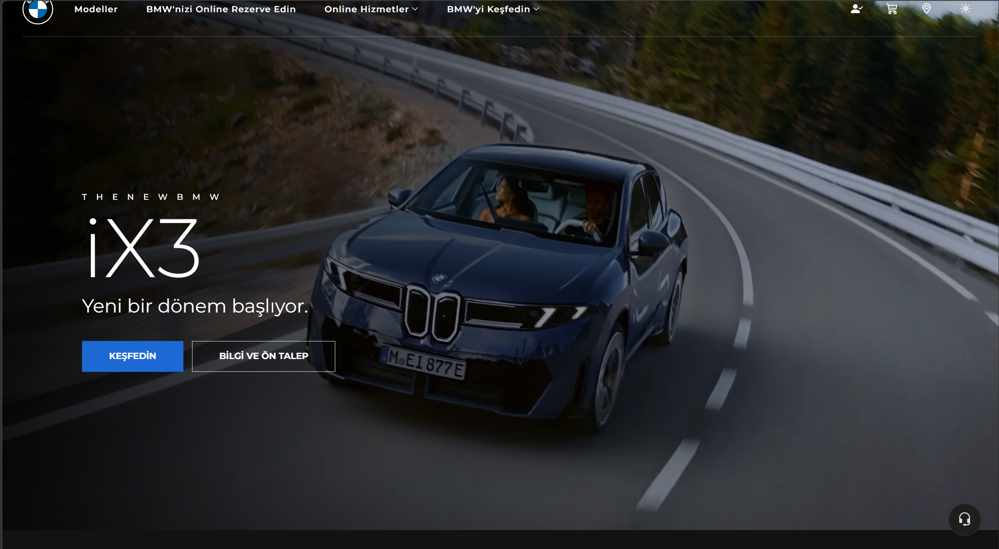
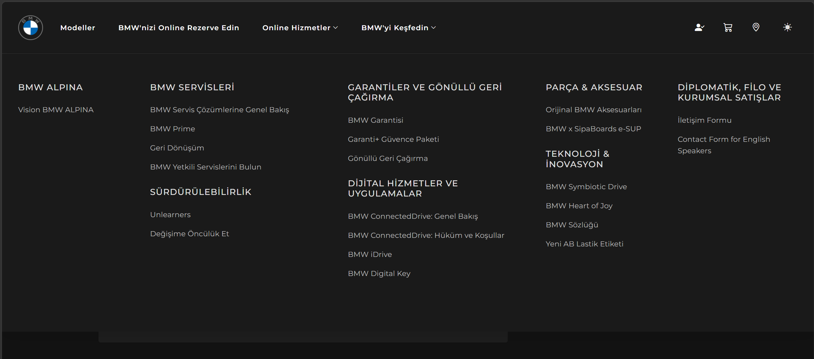
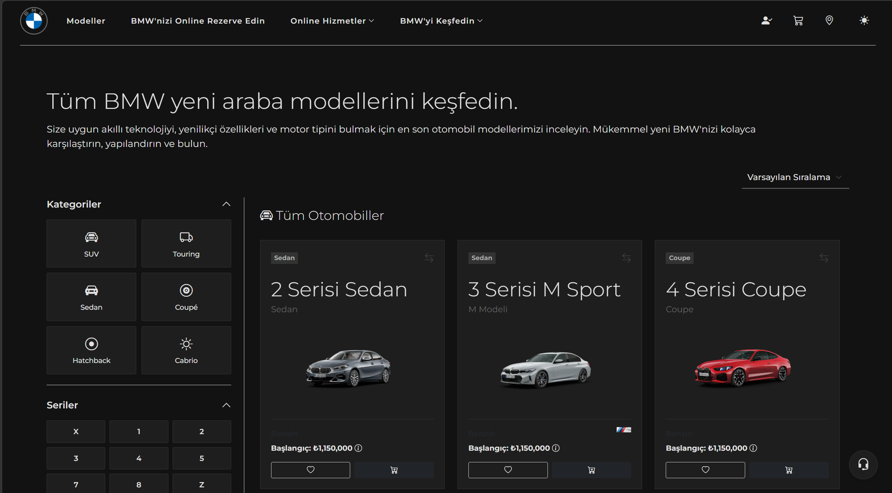
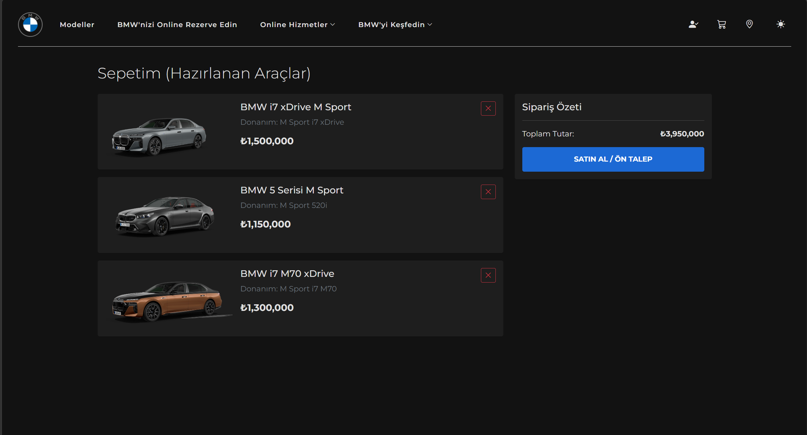

# BMW Bayi Web Sitesi

## Proje Amacı
Bu proje bir üniversite ödevidir. Temel amacı, statik bir BMW Bayi web sitesini (HTML/CSS/JS) ele alarak **RESTful API** ve **MySQL veritabanı** kullanarak dinamik ve tam donanımlı bir web uygulamasına dönüştürmektir. Sitede yer alan fiyat listeleri, model detayları, iletişim formları ve kampanyalar tamamen veritabanından dinamik olarak çekilir ve yönetilir.

## Kullanılan Teknolojiler
- **Frontend:** HTML5, CSS3, Vanilla JavaScript, Bootstrap 5
- **Backend:** Python, Flask, Flask-CORS
- **Veritabanı:** MySQL
- **Güvenlik:** `bcrypt` (Admin şifre hashleme için)

## Kurulum Adımları
Projeyi yerel makinenizde çalıştırmak için aşağıdaki adımları izleyin:

1. **Veritabanını Kurun:**
   MySQL sunucunuzun çalıştığından emin olun.
   Projeyi klonladıktan sonra `backend/init.sql` dosyasını MySQL üzerinde çalıştırarak `bmw_bayi` isimli veritabanını ve örnek verileri (seed verileri) oluşturun.
   ```bash
   mysql -u root -p < backend/init.sql
   ```

2. **Veritabanı Bağlantısını Ayarlayın:**
   `backend/app.py` içerisindeki `DB_CONFIG` kısmında bulunan MySQL kullanıcı adı ve şifrenizi (varsayılan: `root` / `2923`) kendi sisteminize göre güncelleyin.

3. **Gerekli Python Kütüphanelerini Yükleyin:**
   Backend dizinine geçin ve bağımlılıkları yükleyin.
   ```bash
   cd backend
   pip install -r requirements.txt
   ```

4. **Sunucuyu Başlatın:**
   Flask uygulamasını çalıştırarak API ve statik sunucuyu aktif edin.
   ```bash
   python app.py
   ```

5. **Uygulamaya Erişin:**
   Tarayıcınızı açın ve aşağıdaki adrese gidin:
   - Ana Site: `http://localhost:5000`
   - Admin Paneli: `http://localhost:5000/admin.html`

## API Endpointleri
Proje, frontend'i beslemek için aşağıdaki temel REST API servislerini sunar:

- **Seriler:** `GET, POST, PUT, DELETE`
- **Modeller:** `GET, POST, PUT, DELETE`
- **Fiyat Listesi:** `GET, PUT`
- **İletişim Talepleri:** `GET, POST, PATCH, DELETE`
- **Geri Çağırmalar:** `POST`
- **Kampanyalar:** `GET, POST, PUT, DELETE`
- **Auth (Admin):** `POST`
- **Session Temelli İşlemler:**
  - `GET /api/bayiler`
  - `GET, POST, DELETE /api/favoriler`
  - `GET, POST, DELETE /api/sepet`

## Veritabanı Yapısı
Sistem, `bmw_bayi` veritabanı altında tam ilişkisel (Primary Key / Foreign Key) bir yapıda çalışır:
- **seriler**: (Örn: 3 Serisi, X Serisi)
- **modeller**: Seriye bağlı alt modeller. (1-to-N ilişki)
- **donanim_paketleri**: Modele ait motor/donanım paketleri. (1-to-N ilişki)
- **fiyat_listesi**: Donanım paketlerine bağlı fiyat bilgisi.
- **iletisim_talepleri**: Kullanıcılardan gelen iletişim mesajları.
- **geri_cagirmalar**: Şasi numarası (VIN) bazlı servis çağırma sorguları.
- **kampanyalar**: Faiz, kredi ve indirimli model kampanyaları.
- **kullanicilar**: Admin paneline giriş için hashli şifre tutan tablo.
- **bayiler**: Harita veya bayi bulma sistemi için bayi listesi.
- **favoriler** & **sepet**: Session bazlı geçici verileri tutar.

## Ekran Görüntüleri

Aşağıda projenin farklı sayfalarından alınmış ekran görüntüleri yer almaktadır:

### 1. Ana Sayfa (iX3 Tanıtım ve Menü)


### 2. Genişletilmiş Mega Menü ("BMW'yi Keşfedin")


### 3. Filtrelenebilir Modeller Sayfası


### 4. Müşteri Sepeti Sayfası


## Kullanım Örnekleri
- **Kullanıcı Akışı:** Siteye giren bir müşteri "Modeller" sekmesinden araçları filtreler, "Fiyat Listesi" kısmında tüm donanım ve fiyatları listeler ve ilgilendiği araç için "İletişim" sayfasından talebini bırakır. Bu işlemlerin tamamı JSON API üzerinden MySQL'den çekilir.
- **Yönetici Akışı:** "Giriş Yap" butonundan admin paneline erişen yönetici, `/api/iletisim` endpointine düşen taleplerin durumunu "Bekliyor" -> "Arandı" olarak değiştirebilir veya fiyat listesindeki bir fiyatı `PUT` isteği ile güncelleyebilir.
